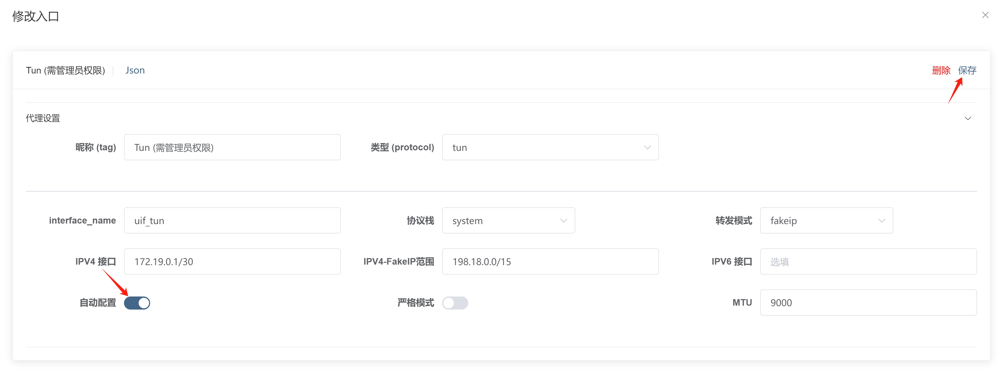

# TUN 方式

该方式侵入式很强，会接管系统所有流量，且开启时需要管理员权限，不建议非程序员使用。

:::tip
目前支持 Windows 和 macOS 自动启动并提权，Linux 请自行使用 Systemd
:::

## 开启/关闭

**重要**

- 首次使用时，请到 [入站页面](https://uiforfreedom.github.io/#/in/my)，选择 `Tun` 点击 `启用`，然后右上角`关闭 UIF`，也就是说必须重启 `uif` 才能生效；

因为 Windows 和 macOS 首次使用时是没有提权，Linux 用户不受限制。

- 非首次使用，直接点击 `启用` 开关即可

:::warning
macOS 使用 Tun 时建议把 interface_name 留空（自动选一个名字），不然的话容易起冲突
:::

## 开机启动

## 设置 IP 路由

TUN 会帮你设置一个网卡，需要设置你的操作系统，使所有的 IP 流量都转发到你的网卡。

UIF 会默认帮你设置好 IP 路由；

在 Windows 中使用 `route print`，在 Linux 中使用 `iptable` 即可查看。

如果你不想自动设置好 IP 路由，到 [入站页面](https://uiforfreedom.github.io/#/in/my)；选择 `Tun` 点击 `详情` -> `代理设置` -> `自动配置`。

## 分流模式

Tun 会接管操作系统的 TCP/UDP 协议栈，正常来说不能也不应该获得套接字（Socks) 的目标地址，但为了能够使用 geosite 进行分流，内核做了很多操作，包括 sniffing 和 FakeIP 等。

如果你使用 FakeIP 模式，顾名思义 DNS 解析时会返回**假的 IP**，内核路由系统通过识别假 IP，从而获得 Socks 地址，那么就可以根据域名分流。

如果你使用 RealIP 模式，顾名思义 DNS 解析时会返回**真的 IP**，内核路由不会获得 Socks 地址，那么就无法域名分流，只能使用 IP 分流。

总的来说，如果你希望`国内直连，国外代理`分流更加精确，建议使用 RealIP。如果你比较在意 DNS 泄露，建议使用 FakeIP。但并不意味着使用 RealIP 不安全，其他人除了设置的 DNS 以外也同样无法知道你日常浏览的内容。
